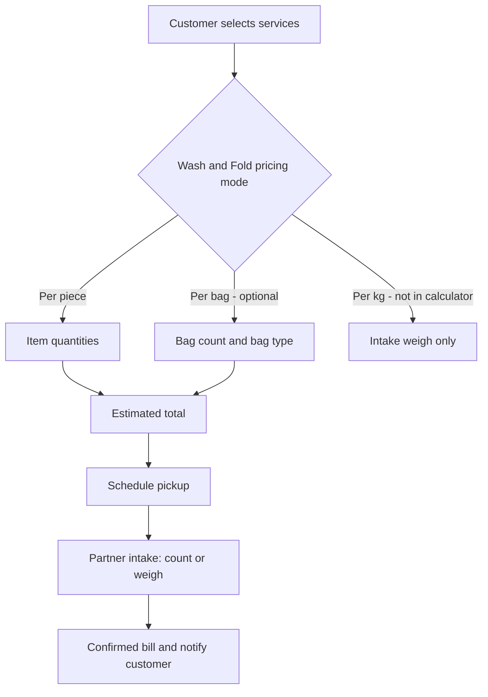

# Laundry App — Services & Pricing Strategy

**Document purpose:** Clarify how the Services section should work for customers and laundry partners, based on product analysis, current app design, and reference apps in the Pakistani market.

**Date:** May 2026  
**Status:** Approved — Partner per-item pricing + intake; customer per-item ordering implemented

---

## 1. Executive summary

The Services flow should separate three ideas that are currently easy to mix up:

| Concept | Meaning |
|--------|---------|
| **Service** | What the customer wants done (e.g. Wash & Fold, Dry Cleaning, Tailoring) |
| **Pricing unit** | How the partner charges (per piece, per standard bag, or per kg) |
| **Quantity** | What the customer enters as an **estimate**; the **final bill** is confirmed after pickup/intake (count or weight) |

**Recommendation:** Use **per-piece (item) pricing** as the primary model for customers. Treat **bags** as operational (pickup/delivery), not as an ambiguous price unit. Use **kg only at intake** to confirm or adjust the final amount—not in the customer price calculator alongside bag and piece options.

Supporting all three pricing modes (bag + kg + item) at once for the same service increases confusion for customers, partners, and operations (e.g. “200 shirts in 1 bag” is not workable without clear rules).

---

## 2. The core problem

When Wash & Fold allows vague quantities without clear rules:

- A customer may think in **items** (e.g. 200 shirts) while selecting **bags** (e.g. 1 bag).
- A partner receives an order that does not match physical reality (one bag cannot hold 200 shirts).
- **Per-kg** pricing only works if weight is measured at pickup; asking customers to estimate kg at home is unreliable.
- Offering **bag, kg, and item** together without one primary unit makes the product hard to explain and hard to fulfill.

This is a **product definition** issue, not only a UI issue. The fix is a clear model: one primary pricing unit per partner offering, plus intake confirmation for the final price.

---

## 3. Reference apps (Pakistani market)

These apps were reviewed for how they handle services, pricing, and quantity:

| App | Link | Relevant pattern |
|-----|------|------------------|
| **JabChaho** | [Bill Calculator](https://www.jabchaho.com/calculator) | Choose **service** → **category** → **items with quantity**. Clear per-item model. |
| **Laundry Xpress** | [Pricing / Order](https://laundryxpress.pk/order-now/) | Large **per-piece catalog** (shirts, shalwar, bedsheet, etc.) by category; **monthly packages** (50/100/200 pcs) for bulk. |
| **Love2Laundry** | [Pricing](https://www.love2laundry.pk/pricing) | **Price estimator** for customers; states that **final price may vary** after weigh/inspect. Minimum order noted on site. |
| **Cleanzo** | [cleanzoapp.com](https://cleanzoapp.com/) | Laundry **marketplace** model (multiple providers). |

### Common patterns across references

1. **Per-piece / per-item** is the default for transparent online ordering.
2. **Bulk** is handled via **packages** (e.g. 50/100/200 pieces), not by mixing “1 bag” with hundreds of items.
3. **Final price** often depends on **inspection or weighing at pickup**, with the app showing an **estimate** first.
4. Services are structured as: **Service type → Item list → Quantity → Total estimate**.

---

## 4. Recommended product model

### 4.1 Service types (customer-facing)

| Service | Customer experience |
|---------|---------------------|
| **Wash & Fold** | Item list + quantities (recommended), or one alternate mode per partner (see below) |
| **Dry Cleaning** | Named items + quantities |
| **Tailoring** | Named items + quantities |
| **Pickup & Delivery** | Separate fee line when enabled |

### 4.2 Wash & Fold — choose one primary pricing mode per partner

Do **not** show bag, kg, and item pricing toggles together for the same partner.

| Mode | Customer enters | Partner receives | Best for |
|------|-----------------|------------------|----------|
| **Per piece (recommended)** | Qty per item type (shirt, trouser, bedsheet, etc.) | Clear pick list and counts | App-based pickup/delivery; aligns with JabChaho / Laundry Xpress |
| **Per standard bag** | Number of bags + bag size/type | Predictable bags if **capacity is defined** (e.g. 1 bag ≈ 15 shirts or ~8 kg) | Traditional wash-and-fold shops that price by bag |
| **Per kg** | Rough estimate optional; **final at intake** | Weight on scale at shop | Traditional counter/dhobi; **not** ideal as sole customer calculator input |

### 4.3 How to handle bags and kg without confusing users

```
Customer order     →  Per PIECE (estimate) — primary
Operational        →  Bags = how clothes are collected/delivered (not the price unit)
Final bill         →  KG or recount at intake (adjustment only, with customer notification)
```

- **Bag:** Use for logistics (“we collect in bags”), not as an undefined price unit.
- **Kg:** Use at **partner intake** to confirm or adjust the bill, not as a third parallel option in the customer flow.

### 4.4 Bulk orders (e.g. 200 shirts)

| Approach | Example |
|----------|---------|
| **Per piece** | 200 × shirt price = clear estimate; partner confirms count at pickup |
| **Per bag (only if defined)** | App suggests bags: 200 ÷ 15 ≈ 14 bags; partner confirms actual bags at pickup |
| **Monthly / corporate package** | Separate product (50/100/200 pcs), as on Laundry Xpress—not mixed with casual per-bag orders |

---

## 5. Should we keep KG and bag pricing?

| Unit | Keep in customer app? | Recommendation |
|------|------------------------|----------------|
| **Per piece** | Yes — primary | **Keep** — simplest for users and partners |
| **Per bag** | Only with strict rules | **Optional later** — one defined “standard bag” + capacity; one mode per partner |
| **Per kg** | Not in customer calculator | **Intake only** — weigh at shop, update final total |

**Conclusion:** Keeping **KG + bag + item** all as customer-facing pricing options at once **will increase complexity** for users and launderers. Simplifying to **per-piece first**, with **kg for final adjustment at intake**, is the lowest-risk path. Bag-based pricing can be added later for partners who need it, with explicit capacity rules and intake confirmation.

---

## 6. End-to-end flow (target)



**Disclaimer (show prominently):**  
*“This is an estimate. Final amount may change after the launderer counts or weighs items at pickup.”*

---

## 7. Example scenarios

### Scenario A — Per piece (recommended)

- Partner: Rs 90 per shirt (Wash & Fold)  
- Customer: 200 shirts → estimate **Rs 18,000**  
- Pickup: partner counts 195 shirts → confirmed **Rs 17,550**

### Scenario B — Per bag (only if capacity is defined)

- Partner: Rs 800 per standard bag (≈ 15 shirts)  
- Customer: ~200 shirts → app suggests **~14 bags** → estimate **Rs 11,200**  
- Pickup: 13 bags received → bill adjusted accordingly

### Scenario C — What to avoid

- Customer selects **1 bag** while expecting **200 shirts** with no capacity rule → partner cannot fulfill or trust the order.

---

## 8. Implementation priorities (phased)

### Phase 1 — Simplify (recommended)

1. **Wash & Fold:** Customer flow uses **per-piece** catalog (similar to Dry Cleaning / Tailoring).  
2. **Remove or hide** customer-facing **kg calculator**; partner sets kg rate only if used at intake.  
3. **Remove bag vs item toggle** until bag capacity rules exist.  
4. Show **estimate disclaimer** on summary and confirmation screens.  
5. Persist **pricing mode** and line items correctly on order submit.

### Phase 2 — Partner intake

1. Partner screen: confirm **actual item count** and/or **weight (kg)**.  
2. Update order to **confirmed total** and notify customer.

### Phase 3 — Optional extensions

1. **Per-bag pricing** for selected partners (one mode only, with defined capacity).  
2. **Monthly / bulk packages** (50/100/200 pcs) as separate products.

---

## 9. Decision checklist

Use this in planning meetings:

- [ ] One **primary pricing unit** per partner for Wash & Fold (not three at once)?  
- [ ] Customer catalog uses **named items + quantity** for Wash & Fold?  
- [ ] **Kg** reserved for intake / final bill, not customer estimate?  
- [ ] **Bag** either removed from pricing or defined with **items/kg per bag**?  
- [ ] **Estimate vs confirmed** wording visible before order submit?  
- [ ] **Bulk / corporate** handled as packages, not ambiguous bag counts?

---

## 10. References (links)

- JabChaho Bill Calculator: https://www.jabchaho.com/calculator  
- Cleanzo: https://cleanzoapp.com/  
- Laundry Xpress Pricing: https://laundryxpress.pk/order-now/  
- Love2Laundry Pricing: https://www.love2laundry.pk/pricing  

---

*Customer app: per-piece wash & fold catalog, estimate disclaimer, `order_service_items` on submit, confirmed total on order detail. Partner intake uses `partner_confirm_order_bill` — run migration `20260522120000_order_intake_confirmed_billing.sql` on Supabase if not already applied.*
